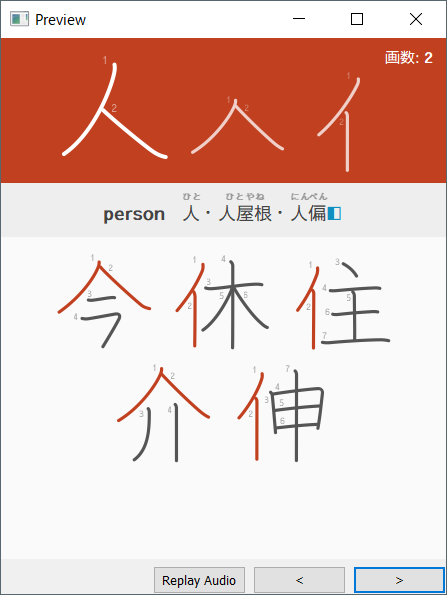

# Bushu Anki Deck

## What is this?
An Anki deck that teaches you how to "see" kanji by familiarising with 190 radicals, their stroke order and how they fit into kanji.

## What's the point of this?
At first sight, kanji are an indecipherable mass of lines. However, kanji are actually made up of repeating components. When you learn how to see the components within kanji I believe you can more easily recognise, distinguish and attach meanings and readings to kanji (at least this has been my finding from my own experimentation!).

I learn kanji not by learning kanji. In other words, rather than learning kanji out of context, I simply see kanji in books and subtitles and acquire it naturally and effortlessly. However, in order to do this I first needed teach my brain how to "see" kanji from the component level. This deck is my method for doing just that.

As I have been using this deck for a year, I now have enough confidence in this method and have decided to make the deck publicly available.
## How do I use this?

**Note:** Although this deck provides an English meaning and a Japanese name for the radical you **do not** have to learn these. You only need learn to produce the correct stroke order by following the procedure below for studying cards.

1. When you see the front of a card, write down the radical on some paper in the stroke order you imagine it is written in. 
2. If you were correct, copy the kanji that appear below the radical on your paper, mark the card as correct and move onto the next.
3. If you were mistaken, write the radical again with the correct stroke order, copy the kanji that appear below the radical and the back of your card on your paper, and mark your card as incorrect.

The pen and paper is important as I believe writing radicals really helps commit the radical and its stroke order to memory. As I side effect of studying this deck I have noticed I can often write  kanji their correct stroke order, even in the case of unfamiliar kanji. 

I studied only 10 new radicals a day and at the same time was studying my vocabulary deck which contains words with example sentences containing kanji with furigana. I also read books with furigana and watch Japanese media with subtitles. I've changed my deck options 'Leech action' to 'Tag Only' as I don't want any of these cards to be suspended.
